```{r setup, include=FALSE}
knitr::opts_chunk$set(echo = TRUE)
setwd("C:\\Users\\natha\\R for Data Scienctists - Data Camp")
# https://rpubs.com/Sergio_Garcia/join_with_dplyr
library(tidyverse)
library(knitr)
library(formatR)
# library(kableExtra) # this will break Rmarkdown on any other laptop other than my Lenovo. I don't know how I set up markdown to work with this package
library(lubridate)
# Resource on how to include images into Rmarkdown:
# https://www.earthdatascience.org/courses/earth-analytics/document-your-science/add-images-to-rmarkdown-report/
```
\newpage

```{r, eval = T, echo = T}
## data can be found here
## https://www.kaggle.com/rtatman/lego-database
# colors <- read.csv("data/colors.csv", header = TRUE)
# inventories <- read.csv("data/inventories.csv", header = TRUE)
# inventory_parts <- read.csv("data/inventory_parts.csv", header = TRUE)
# part_categories <- read.csv("data/part_categories.csv", header = TRUE)
# parts <- read.csv("data/parts.csv", header = TRUE)
# sets <- read.csv("data/sets.csv", header = TRUE)
# themes <- read.csv("data/themes.csv", header = TRUE)

colors <- readRDS("data/colors.rds")
inventories <- readRDS("data/inventories.rds")
inventory_parts <- readRDS("data/inventory_parts.rds")
part_categories <- readRDS("data/part_categories.rds")
parts <- readRDS("data/parts.rds")
sets <- readRDS("data/sets.rds")
themes <- readRDS("data/themes.rds")

```

\newpage

# Joining Tables

## The inner_join() verb

Sometimes datasets are separated into tables that contain that can be linked via an "ID" column. The "ID" column may be meaningless on its own within a respective table, but using the ID to link to other sets where the same ID is present will give you a better and bigger picture of your data. ___Inner join keeps only the rows that are common to both table based on the "by column___.

In the Legos dataset, the theme_id in the **sets** acts as the "ID" column and can be linked to the **themes** table on the id column in that table. For any individual set, we can find a theme that matches. To see the theme that each set is associated with, we'll need to join the two tables. The output is a combined table.

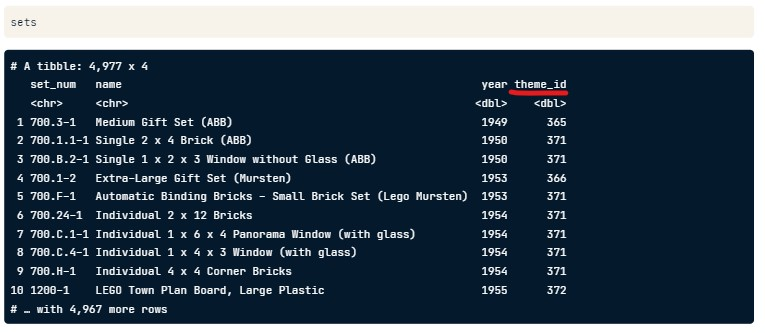
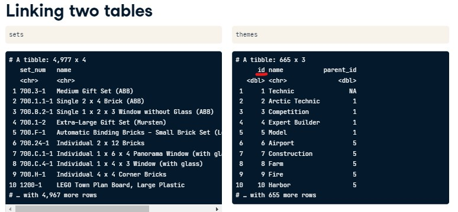

\newpage

```{r, eval = F, echo = T}
sets %>%
  inner_join(themes, by = c("theme_id" = "id"))

# notice that sets and themes both have a column called names
# names.x (sets) and names.y (themes)
# we can change this by customizing the join statement to append the columns that
# have a shared name

sets %>%
  inner_join(themes, by = "theme_id" = "id", suffice = c("_set", "_theme"))
```
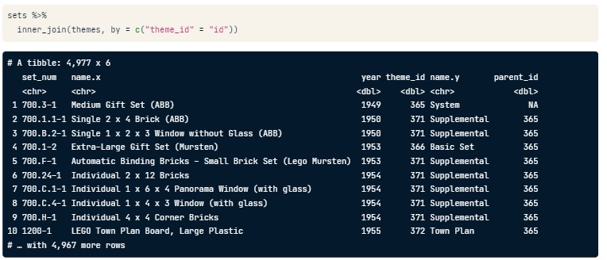
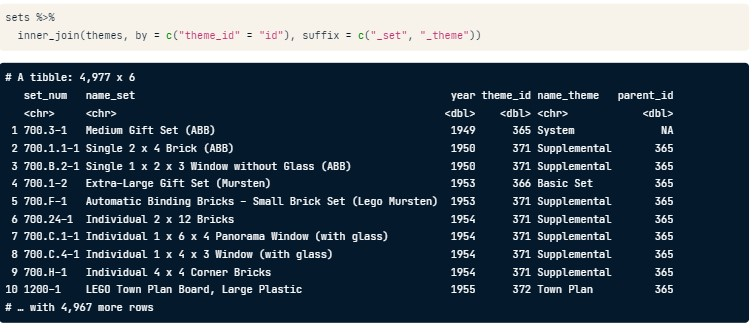
Suppose we want to find the most common themes.

```{r, eval = F, echo = T}
sets %>%
  inner_join(themes, by = c("theme_id" = "id"),
             suffix = c("_set", "_theme")) %>%
  count(name_theme, sort = TRUE)
```

\newpage
We'll work with the **parts** and **part_categories** tables. Which columns will we use to join each table? We'll use part_cat_id from **parts** and "id" from **part_categories**.

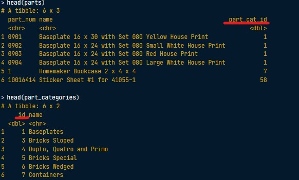
\newpage

### Joining parts and parts categories

The inner_join is the key to bring tables together. To use it, you need to provide the two tables that must be joined and the columns on which they should be joined.

In this exercise, you'll join a list of LEGO parts, available as parts, with these parts' corresponding categories, available as part_categories. For example, the part Sticker Sheet 1 for Set 1650-1 is from the Stickers part category. You can join these tables to see all parts' categories!

* Add the correct joining verb, the name of the second table, and the joining column for the second table.
* Now, use the suffix argument to add "_part" and "_category" suffixes to replace the name.x and name.y fields.
```{r, eval = F, echo = T}
parts %>% 
	inner_join(part_categories, by = c("part_cat_id" = "id"))

parts %>%
  inner_join(part_categories, by = c("part_cat_id" = "id"), suffix = c("_part", "_category"))
```

\newpage
### Joining with one-to-many relationship

In other words, not this is onto, but **not** 1-to-1 e.g., an element of the set A can map to more than one element in the set B.

In the last join we did, both tables convinently had the same number of rows resulting in a nice join; however, not all tables will have the same dataset. There might be times where an element from one table will map to nothing to the other table or an element from one table may map to multiple elements in the other table.

The inventories table has this relation ship with the sets table. 

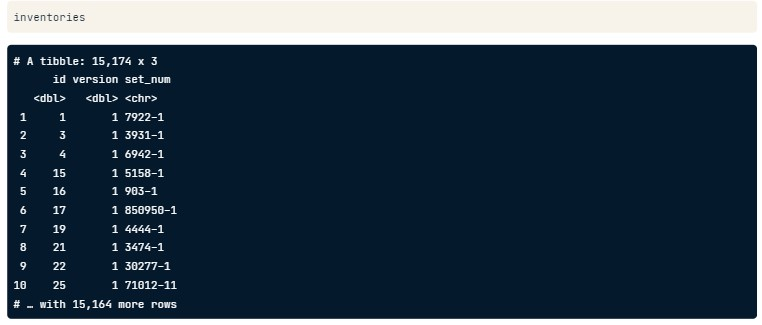

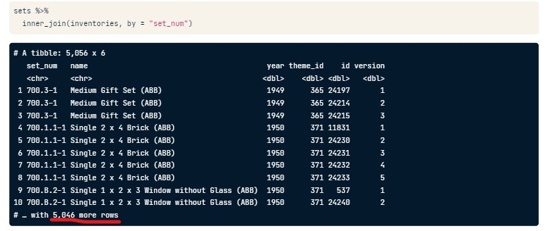

___An inner join keeps an observation only if it has an exact match in both tables.___

\newpage

### Joining parts and inventories

The LEGO data has many tables that can be joined together. Often times, some of the things you care about may be a few tables away (we'll get to that later in the course). For now, we know that parts is a list of all LEGO parts, and a new table, inventory_parts, has some additional information about those parts, such as the color_id of each part you would find in a specific LEGO kit.

Let's join these two tables together to observe how joining parts with inventory_parts increases the size of your table because of the one-to-many relationship that exists between these two tables.

* Connect the parts and inventory_parts tables by their part numbers using an inner join.
```{r, eval = T, echo = T}
temp1 <- parts %>%
  inner_join(inventory_parts, by = c("part_num" = "part_num"))

head(temp1)
```

\newpage

### Joining in either direction

An inner_join works the same way with either table in either position. The table that is specified first is arbitrary, since you will end up with the same information in the resulting table either way.

Let's prove this by joining the same two tables from the last exercise in the opposite order!

* Connect the inventory_parts table with the parts tables.

```{r, eval = T, echo = T}
temp2 <- inventory_parts %>%
  inner_join(parts, by = c("part_num" = "part_num"))
```
\newpage

### Joining three or more tables

Suppose that we want to join the sets, inventories, and themes tables.
```{r, eval = F, echo = T}
sets %>%
  inner_join(inventories, by = "set_num") %>%
  inner_join(themes, by = c("theme_id", "id"), suffix = c("_set", "_theme"))
```

### Joining Three tables

You can string together multiple joins with inner_join and the pipe (%>%), both with which you are already very familiar!

We'll now connect sets, a table that tells us about each LEGO kit, with inventories, a table that tells us the specific version of a given set, and finally to inventory_parts, a table which tells us how many of each part is available in each LEGO kit.

So if you were building a Batman LEGO set, sets would tell you the name of the set, inventories would give you IDs for each of the versions of the set, and inventory_parts would tell you how many of each part would be in each version.

* Combine the inventories table with the sets table.
* Next, join the inventory_parts table to the table you created in the previous join by the inventory IDs.
```{r, eval = T, echo = T}
blah <- sets %>%
  inner_join(inventories, by = "set_num") %>%
  inner_join(inventory_parts, by = c("id" = "inventory_id"))

head(blah)
```

\newpage

### What's the most common color?

Now let's join an additional table, colors, which will tell us the color of each part in each set, so that we can answer the question, "what is the most common color of a LEGO piece?"

* Inner join the colors table using the color_id column from the previous join and the id column from colors; use the suffixes "_set" and "_color".

* Count the name_color column and sort the results so the most prominent colors appear first.
```{r, eval = T, echo = T}
# sets %>%
#   inner_join(inventories, by = "set_num") %>%
#   inner_join(inventory_parts, by = c("id" = "inventory_id")) %>%
#   inner_join(colors, by = c("color_id" = "id"), suffix = c("_set", "_color")) %>%
#   count(1, name_color, sort = TRUE)

blah <- sets %>%
	inner_join(inventories, by = "set_num") %>%
	inner_join(inventory_parts, by = c("id" = "inventory_id")) %>%
	inner_join(colors, by = c("color_id" = "id"), suffix = c("_set", "_color")) %>%
	count(name_color, sort = TRUE)

head(blah)
```

\newpage

# Left and Right Joins
## The left_join() verb

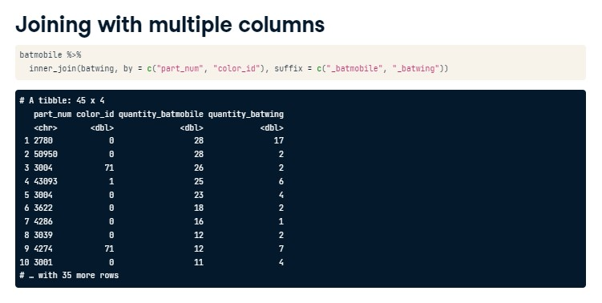
We can join on multiple columns by passing a vector to the by statement inside the join verb. The above inner_join() on two columns (part_num & color_id) will return a table that has pieces that are in common between the batmobile and batwing. For example, part_num = 2780 appears 28 times in the batmobile set and 17 times in the batwing set. ***Remember that an inner join only keeps observations that appear in both tables***

What if we only wanted to keep parts that are in the batmobile set (left) but not in the batwing set (right)? In other words, if we only want to keep observations in only one of the tables, we shouldn't use an inner join and should refer to a left or right join.


Notice now that the quantity_batwing columns have NAs in some entries. Also note that the size of the tibble is larger in the left join compared to the right join i.e., inner join will not return parts that are only existing on one table but not the other. 

\newpage
### Diagram of inner join vs. left join
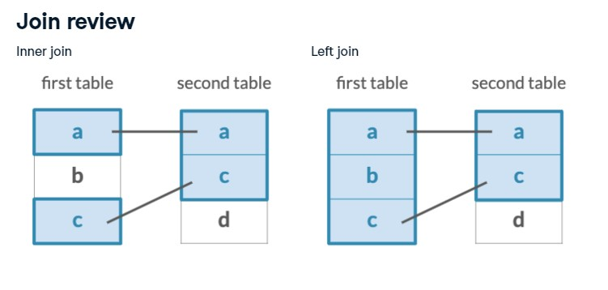
Notice that the inner join only returns a table where there is a match in both tables whereas the left join will return a table containing all of the elements of the left table.

Mathematically, an inner join is like a one-to-one and onto mapping between both sets (both tables).

\newpage

### Left joining two sets by part and color
In the video, you learned how to left join two LEGO sets. Now you'll practice your ability to do this looking at two new sets: the Millennium Falcon and Star Destroyer sets. We've created these for you and they have been preloaded for you:

* Left join the star_destroyer and millennium_falcon tables on the part_num and color_id columns with the suffixes _falcon and _star_destroyer.
```{r, eval = T, echo = T}
# create table using inner join on inventories and inventory_parts by = c("id" = "inventory_id")
inventory_parts_joined <- inventories %>%
  inner_join(inventory_parts, by = c("id" = "inventory_id")) %>%
  select(-id, -version) %>%
  arrange(desc(quantity))

# obtaining the parts for the millennium falcon set
millennium_falcon <- inventory_parts_joined %>%
  filter(set_num == "7965-1")

# obtaining the parts fo the star destroyer set
star_destroyer <- inventory_parts_joined %>%
  filter(set_num == "75190-1")

head(millennium_falcon %>%
  left_join(star_destroyer, by = c("part_num", "color_id"), suffix = c("_falcon", "_star_destroyer")))
```
Seems like something's wrong with my data set.
```{r, eval = T, echo = T}
# Aggregate Millennium Falcon for the total quantity in each part
millennium_falcon_colors <- millennium_falcon %>%
  group_by(color_id) %>%
  summarize(total_quantity = sum(quantity))

# Aggregate Star Destroyer for the total quantity in each part
star_destroyer_colors <- star_destroyer %>%
  group_by(color_id) %>%
  summarize(total_quantity = sum(quantity))

# Left join the Millennium Falcon colors to the Star Destroyer colors
millennium_falcon_colors %>%
  left_join(star_destroyer_colors, by = "color_id",
  suffix = c("_falcon", "_star_destroyer"))
```
\newpage

### Finding an observation that doesn't have a match

Left joins are really great for testing your assumptions about a data set and ensuring your data has integrity.

For example, the inventories table has a version column, for when a LEGO kit gets some kind of change or upgrade. It would be fair to assume that all sets (which joins well with inventories) would have at least a version 1. But let's test this assumption out in the following exercise.

* Use a left_join to join together sets and inventory_version_1 using their common column.
* filter for where the version column is NA using is.na.
```{r, eval = T, echo = T}
inventory_version_1 <- inventories %>%
  filter(version == 1)

# Join versions to sets
sets %>%
  left_join(inventory_version_1, by = "set_num") %>%
  # Filter for where version is na
  filter(is.na(version))
```
Hey! It looks like there are cases where a set does not have an original version. In Chapter 3, you'll learn another way to find observations like this: anti_join.

\newpage

## The right_join()

A right join functions very similarly as the left join. A right join keeps all of the observations in the second/right table regardless of whether or not it appears in the first/left table.
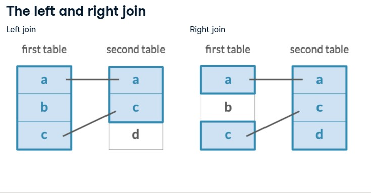
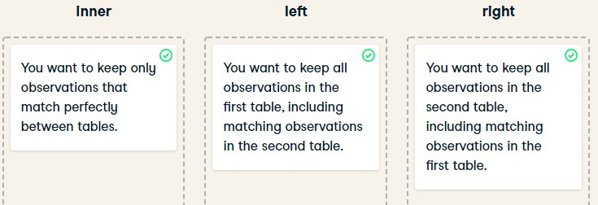
\newpage

### Counting part colors


Sometimes you'll want to do some processing before you do a join, and prioritize keeping the second (right) table's rows instead. In this case, a right join is for you.

In the example below, we'll count the part_cat_id from parts, before using a right_join to join with part_categories. The reason we do this is because we don't only want to know the count of part_cat_id in parts, but we also want to know if there are any part_cat_ids not present in parts.

* Use the count verb to count each part_cat_id in the parts table

* Use a right_join to join part_categories. You'll need to use the part_cat_id from the count and the id column from part_categories.

* filter for where the column n is NA.
```{r, eval = T, echo = T}
parts %>%
	count(part_cat_id) %>%
	right_join(part_categories, by = c("part_cat_id" = "id")) %>%
	# Filter for NA
	filter(is.na(n))
	
```

### Cleaning up your count
In both left and right joins, there is the opportunity for there to be NA values in the resulting table. Fortunately, the replace_na function can turn those NAs into meaningful values.

In the last exercise, we saw that the n column had NAs after the right_join. Let's use the replace_na column, which takes a list of column names and the values with which NAs should be replaced, to clean up our table
```{r, eval = T, echo = T}
blah <- parts %>%
	count(part_cat_id) %>%
	right_join(part_categories, by = c("part_cat_id" = "id")) %>%
	# Use replace_na to replace missing values in the n column
	replace_na(list(n = 0))

head(blah)
```
\newpage

## Joining tables to themselves

Some data sources have a "parent id" which means that the table is related to itself. When this is the case, we are dealing with a hierachical table.

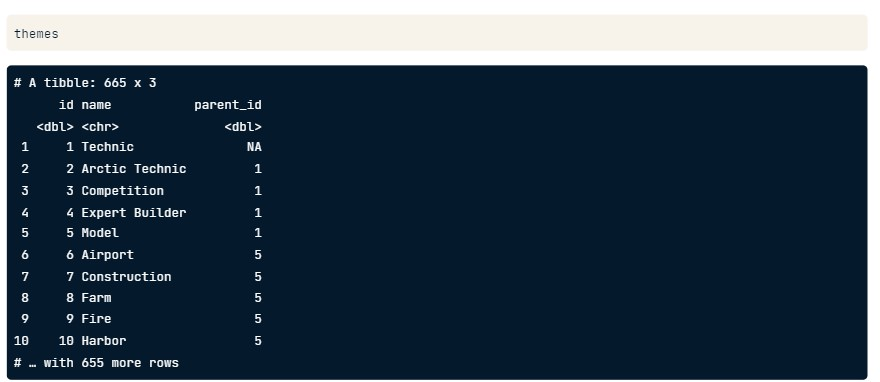

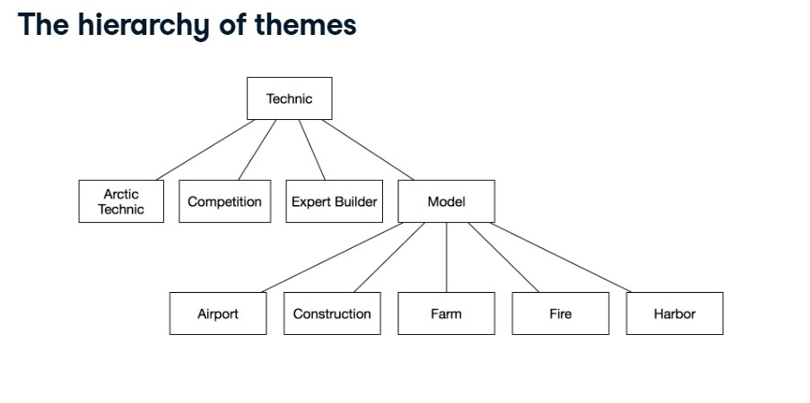
\newpage

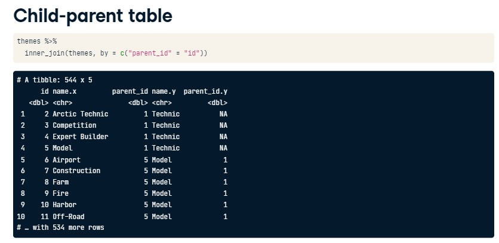

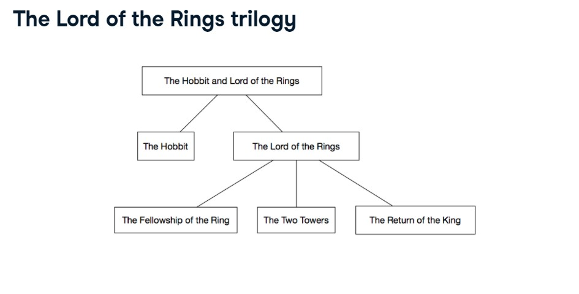
\newpage

### Joining themes to their children
Tables can be joined to themselves!

In the themes table, which is available for you to inspect in the console, you'll notice there is both an id column and a parent_id column. Keeping that in mind, you can join the themes table to itself to determine the parent-child relationships that exist for different themes.

In the videos, you saw themes joined to their own parents. In this exercise, you'll try a similar approach of joining themes to their own children, which is similar but reversed. Let's try this out to discover what children the theme "Harry Potter" has.

* Inner join themes to their own children, resulting in the suffixes "_parent" and "_child", respectively

* Filter this table to find the children of the "Harry Potter" theme.
```{r, eval = T, echo = T}
blah <- themes %>%
  inner_join(themes, by = c("id" = "parent_id"), suffix = c("_parent", "_child")) %>%
  filter(name_parent == "Harry Potter")

head(blah)
```

\newpage
### Joining themes to their grandchildren
We can go a step further than looking at themes and their children. Some themes actually have grandchildren: their children's children.

Here, we can inner join themes to a filtered version of itself again to establish a connection between our last join's children and their children.

* Use another inner join to combine themes again with itself.
  * Be sure to use the suffixes "_parent" and "_grandchild" so the columns      in the resulting table are clear.
  * Update the by argument to specify the correct columns to join on. If 
    you're unsure of what columns to join on, it might help to look at the 
    result of the first join to get a feel for it.
```{r, eval = T, echo = T}
# themes %>% 
#   inner_join(themes, by = c("id" = "parent_id"), suffix = c("_parent", "_child")) %>%
#   inner_join(themes, by = c("parent_id" = "id_child"), suffix = c("_parent", "_grandchild"))

blah <- themes %>% 
  inner_join(themes, by = c("id" = "parent_id"), suffix = c("_parent", "_child")) %>%
  inner_join(themes, by = c("id_child" = "parent_id"), suffix = c("_parent", "_grandchild"))
head(blah)
```
Awesome! It looks like there are 158 grandparent-grandchild relationships of LEGO themes. Now you're a whiz at using self joins to learn about hierarchical relationships.

\newpage

## Left Joining a table to itself

```{r, eval = T, ehco = F}

```

